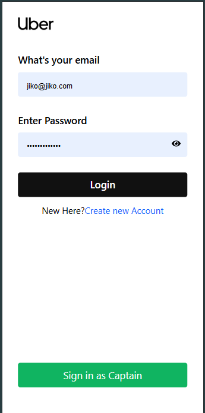
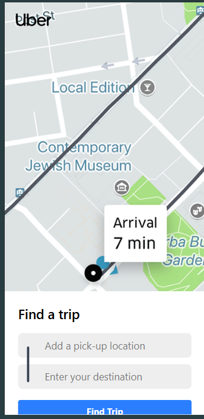
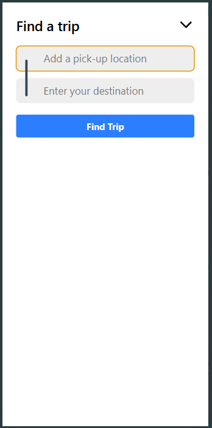
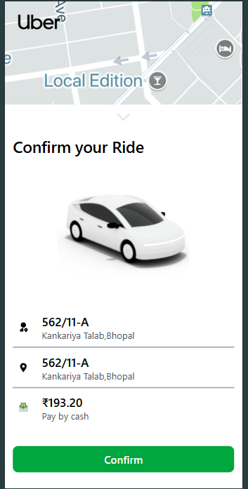
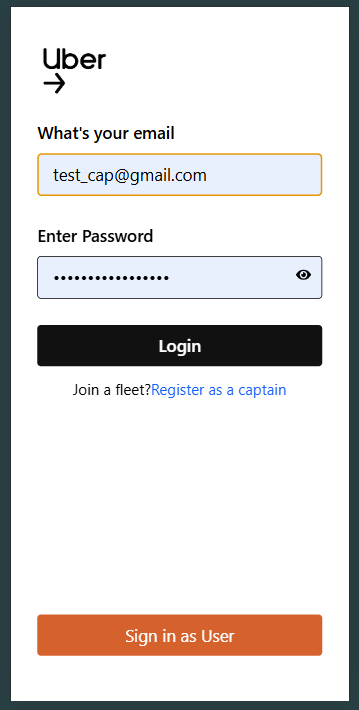
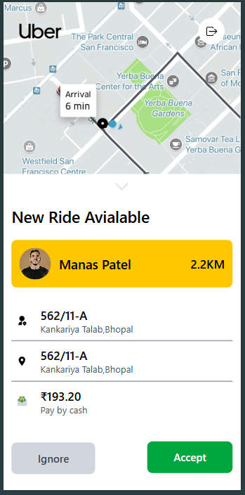
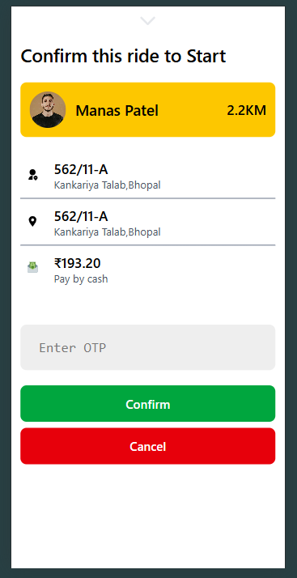
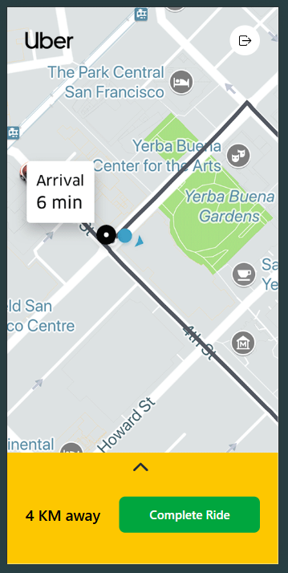
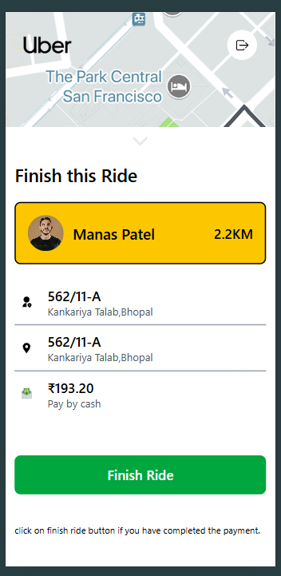
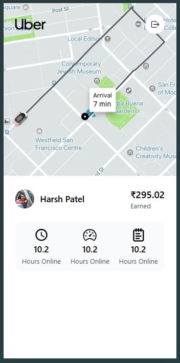

# Uber Clone Project

## Overview

This project is an Uber clone built using the MERN stack (MongoDB, Express.js, React.js, Node.js). It provides a basic interface for both users and captains to log in and book rides. The project was a significant learning experience, allowing me to explore various technologies and concepts in web development.

## Features

- User and Captain login functionality
- Ride booking interface
- Current fare tracking

## Important Note

Due to the limitations of the Google API Gateway prepayment system, I have decided to drop the live tracking and distance location features. However, I plan to complete these dropped features over time as I continue to learn and grow in my development skills. This decision was made to simplify the project and focus on the core functionalities.

## Learning Experience

Throughout the development of this project, I encountered numerous challenges and opportunities for growth. It has been one of the best learning experiences of my life, enhancing my skills in both frontend and backend development.

## Installation

To get started with the project, follow these steps:

1. Clone the repository:

   ```bash
   git clone [repository-url](https://github.com/jarvisonline/Uber-Clone.git)
   ```

2. Navigate to the project directory:

   ```bash
   cd <UBER-ClONE>
   ```

3. Install the dependencies for both the frontend and backend:

   ```bash
   cd frontend
   npm install
   cd ../backend
   npm install
   ```

4. Start the backend server:

   ```bash
   cd backend
   npx nodemon
   ```

5. Start the frontend client:
   ```bash
   cd frontend
   npm run dev
   ```

## Project Showcase

Here are some images showcasing the project:

- 
- 
- 
- 
- 
- 
- 
- 
- 
- 
- 
- 
- 

## Contributing

If you would like to contribute to this project, please fork the repository and submit a pull request.
